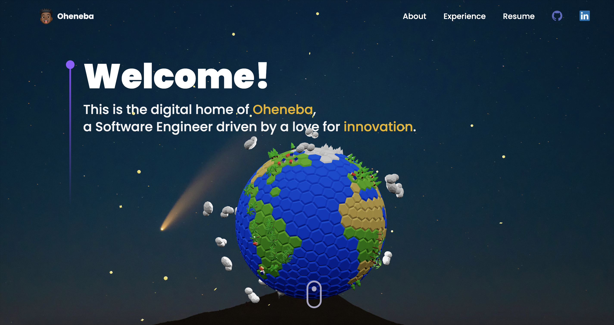

# 🌟 Oheneba Berko - Interactive 3D Portfolio

<div align="center">



**A cutting-edge 3D portfolio website showcasing modern web development with Three.js, React, and innovative design**

[](https://ohenebaportfolio.netlify.app/)
[](https://github.com/Orphy123/Oheneba-Portfolio-Website)

[🚀 View Live](https://ohenebaportfolio.netlify.app/) • [📋 Resume](https://drive.google.com/file/d/12FhPfz9vzcZTz3-Vxob8HuQRHz-DAv4h/view?usp=sharing) • [💼 LinkedIn](https://www.linkedin.com/in/ohenebaberko-123/) • [👨‍💻 GitHub](https://github.com/Orphy123)

</div>

---

## ✨ Overview

This isn't just another portfolio website—it's an **interactive 3D experience** that combines cutting-edge web technologies with engaging storytelling. Built with React and Three.js, it features immersive 3D elements, smooth animations, and a modern design that showcases my journey as a **Lead Software Engineer** and **AI/ML enthusiast**.

### 🎯 What Makes This Special

- **🌍 Interactive 3D Globe**: Powered by Three.js and React Three Fiber
- **🎬 Cinematic Animations**: Smooth transitions with Framer Motion
- **📱 Fully Responsive**: Optimized for all devices and screen sizes
- **⚡ Blazing Fast**: Built with Vite for optimal performance
- **🎨 Modern UI/UX**: Custom Tailwind CSS styling with beautiful gradients
- **🏆 Real Projects**: Featuring actual applications from AI platforms to mobile apps

---

## 🛠️ Technology Stack

<div align="center">

### Frontend Technologies


### 3D & Animation


### Additional Libraries


</div>

---

## 🌟 Key Features

### 🎮 Interactive 3D Elements

- **Dynamic Earth Globe**: Rotating planet with realistic textures and lighting
- **Floating Tech Icons**: 3D spheres showcasing technology stack
- **Particle System**: Animated star field background for immersive experience

### 📱 Professional Sections
- **Hero Landing**: Engaging introduction with animated 3D Globe
- **About Me**: Interactive cards highlighting Full-Stack, iOS, Android, and Software Engineering skills
- **Experience Timeline**: Professional journey from Research Assistant to Lead Software Engineer
- **Tech Stack**: 3D visualization of programming languages and technologies
- **Project Showcase**: Featured applications including AI platforms and mobile apps
- **Testimonials**: Feedback from colleagues and collaborators

### 🔥 Advanced Functionality
- **Smooth Scrolling**: Seamless navigation between sections
- **Parallax Effects**: Depth and motion for enhanced visual appeal
- **Responsive Design**: Perfect experience on desktop, tablet, and mobile
- **Performance Optimized**: Fast loading with lazy loading and suspense
- **SEO Friendly**: Optimized for search engines and social sharing

---

## 🚀 Featured Projects

<div align="center">

| Project | Description | Technologies |
|---------|-------------|-------------|
| **🤖 Mastery.ai** | AI-powered learning companion with personalized help and spaced repetition | React, OpenAI API, MongoDB |
| **📈 Financial Edge AI** | Trading platform with AI market predictions and sentiment analysis | TypeScript, React, Supabase |
| **🏢 Okada Hackathon** | AI-powered Commercial Real Estate assistant with RAG technology | Python, React, OpenAI API |
| **🔍 YOLO Car Detection** | Deep learning model for real-time car object detection | Python, TensorFlow, YOLO |
| **📱 Android MineSweeper** | Modern MineSweeper with customizable dimensions and sleek UI | Kotlin, Java, Android |
| **🌤️ Weather App** | Advanced weather tracking with location services | Kotlin, OneMap API, Fused Location Provider |

</div>

---

## 💼 Professional Experience

### 🏆 Current Role
**Lead Software Engineer** at **Open Trellis** *(August 2023 - Present)*
- Drive end-to-end development of products with React/Next.js and Node.js
- Architect fault-tolerant backend systems with TypeScript, Prisma, and Redis
- Provide technical leadership and strategic guidance to development teams

### 🌟 Previous Experience
- **Software Engineering Intern** at **LLAMAWOOD** - Developed scalable firewood delivery platform
- **Software Engineering Intern** at **Bashpole Software** - Led UI overhaul increasing engagement by 20%
- **Research Assistant** at **University of Richmond** - Developed adversarial attacks against RNN speech recognition models

---

## 🎨 Design Philosophy

This portfolio embodies **modern web development principles**:

- **🎯 User-Centric Design**: Intuitive navigation and engaging interactions
- **⚡ Performance First**: Optimized loading and smooth animations
- **📱 Mobile-First Approach**: Responsive design that works everywhere
- **♿ Accessibility**: Inclusive design for all users
- **🎨 Visual Hierarchy**: Clear information structure with beautiful typography

---

## 🚀 Quick Start

### Prerequisites
- Node.js (version 14 or higher)
- npm or yarn package manager

### Installation

```bash
# Clone the repository
git clone https://github.com/Orphy123/Oheneba-Portfolio-Website.git

# Navigate to project directory
cd Oheneba-Portfolio-Website

# Install dependencies
npm install

# Start development server
npm run dev

# Build for production
npm run build
```

### 🌐 Deployment
The portfolio is deployed on **Netlify** with automatic deployments from the main branch.

---


## 🎯 Performance & Optimization

- **⚡ Vite Build Tool**: Lightning-fast development and build process
- **🎨 CSS-in-JS**: Tailwind CSS for optimized styling
- **📦 Code Splitting**: Lazy loading for optimal performance
- **🖼️ Image Optimization**: Compressed assets for faster loading
- **🔄 Suspense & Preload**: React features for smooth loading states

---

## 🤝 Connect With Me

<div align="center">

[](https://ohenebaportfolio.netlify.app/)
[](https://linkedin.com/in/oheneba-berko)
[](https://github.com/Orphy123)
[](https://drive.google.com/file/d/12FhPfz9vzcZTz3-Vxob8HuQRHz-DAv4h/view?usp=sharing)

</div>

---

## 📝 License

This project is open source and available under the [MIT License](LICENSE).

---

<div align="center">

**⭐ If you found this portfolio inspiring, please give it a star!**


</div>
